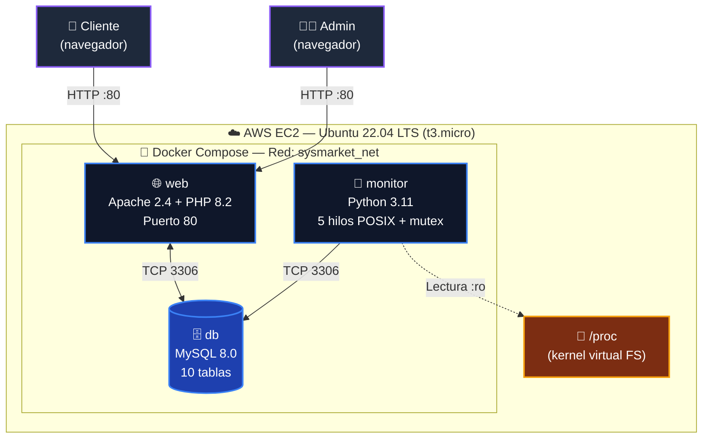

# SysMarket v2

> **E-commerce de componentes de PC con monitoreo del sistema operativo en tiempo real.**
> Trabajo Final — Sistemas Operativos · USIL 2026-I · Grupo 01


---

## ¿Qué es SysMarket?

SysMarket es una **tienda en línea de componentes de PC** (procesadores, GPUs, RAM, almacenamiento, periféricos) con un **panel administrativo que monitorea en tiempo real los recursos del sistema operativo** donde corre la aplicación. Está construido como demostración funcional de los conceptos centrales del curso de Sistemas Operativos: hilos POSIX, sincronización con mutex, lectura del sistema de archivos virtual `/proc` y uso de llamadas al sistema (syscalls).

El proyecto consta de **tres contenedores Docker** orquestados con Docker Compose, desplegados sobre una instancia **AWS EC2 Ubuntu 22.04**, accesible por IP pública desde cualquier navegador.

---

## Arquitectura



**Flujo de datos:**

1. El navegador del cliente envía peticiones HTTP al puerto 80 de la instancia EC2.
2. Apache (en el contenedor `web`) recibe la petición y la procesa con PHP.
3. PHP consulta la BD MySQL (contenedor `db`) por la red interna de Docker usando el hostname `db`.
4. En paralelo, el contenedor `monitor` lee continuamente `/proc` del kernel del host (montado en modo solo lectura) y persiste métricas en MySQL cada 5 segundos.
5. Cuando el administrador accede a `/monitor.php`, ve gráficas en tiempo real con los datos que el daemon Python ha estado recopilando.

---

## Conceptos de Sistemas Operativos aplicados

| Concepto | Implementación |
|---|---|
| **Hilos POSIX (pthreads)** | `monitor.py` arranca 5 hilos concurrentes con `threading.Thread()`, que internamente invoca `pthread_create()` del kernel Linux |
| **Mutex / Sincronización** | `threading.Lock()` protege el diccionario compartido de métricas, evitando race conditions entre los 5 hilos |
| **Sistema de archivos virtual /proc** | Lectura directa de `/proc/stat`, `/proc/meminfo`, `/proc/loadavg`, `/proc/[pid]/status` |
| **Llamadas al sistema (syscalls)** | `os.statvfs('/')` invoca la syscall `statvfs()` del kernel para obtener información del filesystem |
| **Procesos vs Hilos** | Cada contenedor Docker es un proceso aislado por namespaces; dentro de `monitor` hay 5 hilos POSIX |
| **Aislamiento de procesos** | Docker usa cgroups + namespaces del kernel Linux para aislar los 3 servicios |
| **Concurrencia transaccional** | El checkout usa `BEGIN`, `SELECT ... FOR UPDATE` (lock pesimista), `COMMIT`/`ROLLBACK` |

---

## Stack tecnológico

| Capa | Tecnología | Versión | Rol |
|---|---|---|---|
| Sistema operativo | Ubuntu Server | 22.04 LTS | Kernel Linux, host de los contenedores |
| Orquestación | Docker Engine + Compose | 29.x / v2 | Aislamiento y red interna |
| Servidor web | Apache HTTP Server | 2.4 | Atiende peticiones HTTP |
| Backend | PHP | 8.2 | Lógica de e-commerce |
| Base de datos | MySQL | 8.0 | Persistencia |
| Monitor del SO | Python | 3.11 | Daemon multihilo |
| Frontend | Bootstrap + Chart.js | 5.3 / 4.4 | Maquetación y visualización |
| Infraestructura cloud | AWS EC2 | t3.micro | Servidor en producción |
| Seguridad | bcrypt + PDO + UFW | — | Hashing, prepared statements, firewall |

---

## Funcionalidades principales

### 🛒 Lado tienda (usuarios)

- Registro y login con contraseñas hasheadas con bcrypt
- Catálogo con 6 categorías y 24 productos en stock
- Filtros por categoría y buscador por nombre
- Detalle de producto con productos relacionados
- Carrito de compras con AJAX (sin recargar página)
- Checkout transaccional con verificación de stock (lock pesimista)
- Histórico de pedidos por usuario

### 📊 Lado administrativo (rol admin)

- Panel con KPIs (usuarios totales, pedidos del día, ingresos)
- Tabla de usuarios, pedidos y productos más vendidos
- **Monitor de SO en tiempo real** con:
  - Gráficas históricas de CPU (basadas en `/proc/stat`)
  - Memoria RAM (`/proc/meminfo`)
  - Uso de disco (syscall `statvfs()`)
  - Carga promedio del sistema (`/proc/loadavg`)
  - Top procesos por uso de RAM (`/proc/[pid]/status`)
- Alertas configurables por umbrales de CPU/RAM

---

## Quick Start — Local con Docker

**Prerequisitos:** Docker Desktop o Docker Engine instalado.

```bash
# 1. Clonar el repositorio
git clone https://github.com/Hreon/S.O-SYS.git
cd S.O-SYS

# 2. Levantar los 3 contenedores
docker compose up -d --build

# 3. Esperar 30 segundos a que MySQL se inicialice
sleep 30

# 4. Abrir en el navegador
# http://localhost
```

**Credenciales demo** (definidas en `mysql/init.sql`):

| Rol | Email | Contraseña |
|---|---|---|
| Admin | `admin@sysmarket.com` | `password` |
| Cliente | `cliente@sysmarket.com` | `password` |

---

## Quick Start — Despliegue en AWS EC2

```bash
# 1. Crear instancia EC2 t3.micro con Ubuntu 22.04 LTS
# 2. Configurar Security Group: SSH (22), HTTP (80), HTTPS (443)
# 3. Conectarse por SSH

ssh -i sysmarket-key.pem ubuntu@<IP_PUBLICA>

# 4. Clonar y desplegar
git clone https://github.com/Hreon/S.O-SYS.git
cd S.O-SYS
bash deploy_aws.sh           # Instala Docker y dependencias
newgrp docker                 # Aplica el grupo docker sin re-loguear
docker compose up -d --build

# 5. Abrir en el navegador: http://<IP_PUBLICA>
```

El script `deploy_aws.sh` instala Docker Engine, configura el firewall UFW y deja todo listo para `docker compose up`.

---

## Estructura del repositorio

```
sysmarket_v2/
├── apache-php/
│   ├── Dockerfile
│   └── src/                       # Raíz pública del sitio
│       ├── index.php, productos.php, producto.php
│       ├── carrito.php, checkout.php, login.php, registro.php
│       ├── mi-cuenta.php, monitor.php, admin.php
│       ├── api/                   # Endpoints AJAX
│       ├── includes/              # auth.php, db.php, header.php
│       └── assets/                # CSS, JS, imágenes
├── monitor/
│   ├── Dockerfile
│   ├── requirements.txt
│   └── monitor.py                 # Daemon multihilo con 5 hilos POSIX + mutex
├── mysql/
│   └── init.sql                   # Esquema + 24 productos seed
├── docs/                          # Documentación académica
│   ├── Avance02_SO_G1_SysMarket.docx
│   ├── Guia_Implementacion_SysMarket.docx
│   ├── Manual_Usuario_SysMarket.docx
│   └── Presentacion_SysMarket_v2.pptx
├── docker-compose.yml             # Orquestación de los 3 servicios
├── deploy_aws.sh                  # Script de instalación para AWS EC2
└── README.md
```

---

## Equipo

| Rol | Integrante |
|---|---|
| Líder | Fabian Roncal Falconi |
| Integrante | Luz Rios Rios |
| Integrante | Piero Valencia Corilla |

**Docente:** Eduardo Vásquez Reyes
**Universidad:** Universidad San Ignacio de Loyola (USIL)
**Curso:** Sistemas Operativos · Ciclo 2026-I

---

## Licencia

Proyecto académico. Uso libre con fines educativos.
